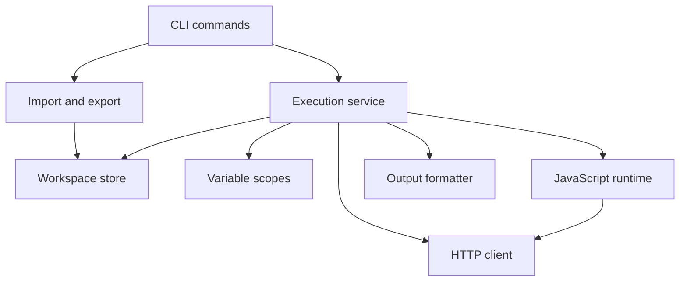
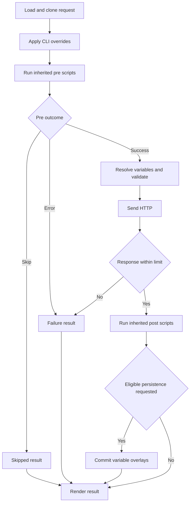

# High-Level Design

A single Go binary accepts direct or saved requests and routes both through one execution service. Persistence, JavaScript and formatting are adapters around HTTP execution. Phase 0 exercises only CLI → HTTP → output; storage and scripting are added after that works.

## Components

- **CLI — internal/cli:** Parses flags, invokes services and maps results to exit codes; keeps stdout/stderr injectable.
- **Execution — internal/execution:** Owns inherited scripts, variable resolution, HTTP sequencing, persistence eligibility and result aggregation.
- **Store — internal/store:** Resolves paths/IDs, validates versioned JSON, locks mutations and detects revision conflicts.
- **Variables — internal/variables:** Supplies explicit scope precedence and one-pass interpolation without exposing arbitrary process state.
- **HTTP — internal/httpclient:** Builds bodies, executes context-aware HTTP and owns transport policy; it never evaluates scripts.
- **JavaScript — internal/scripting:** Runs supported pm APIs on one runtime owner, tracks async host work and enforces deadlines.
- **Import/export — internal/importer and internal/exporter:** Converts supported Postman/cURL forms with clear errors or warnings for loss.
- **Output — internal/output:** Keeps bodies and JSON envelopes on stdout, diagnostics on stderr and large downloads streaming.

## Key decisions & trade-offs

- Native Go HTTP plus embedded JavaScript preserves a single-binary experience. Phase 1 selected and pinned Goja; its existing owner-loop spike is not yet the production Postman API.
- One JSON file per collection keeps folders/requests inspectable and single-file CRUD atomic. Variable persistence across two files adds a small recovery journal late in the plan.
- Compatibility is explicit: the supported pm surface is in IMPLEMENTATION.md. Unsupported dynamic calls fail at runtime; imports cannot statically prove arbitrary JS compatibility.
- Variables resolve after pre scripts, allowing generated tokens to affect the actual outgoing request. CLI variable overrides stay highest priority.
- Both script phases use collection → outer folder → inner folder → request order; response HTTP errors still allow post scripts.
- Small phases give usable checkpoints. Later-phase interfaces are refined only after the earlier code is validated, avoiding speculative full-system abstractions.

## Execution flow

This diagram shows where failures, skips and persistence enter a saved-request run.

## Research notes and primary references

- [Goja repository](https://github.com/dop251/goja): pure-Go JS implementation; one runtime cannot be used concurrently by multiple goroutines. Verify and pin a toolchain-compatible release/commit during Phase 1.
- [Goja API documentation](https://pkg.go.dev/github.com/dop251/goja): Interrupt stops running JavaScript but does not interrupt native Go calls. Host HTTP must separately honor context cancellation.
- [Postman script ordering](https://learning.postman.com/docs/tests-and-scripts/write-scripts/intro-to-scripts): collection/folder/request hierarchy applies to pre and post phases.
- [Postman pm.sendRequest](https://learning.postman.com/docs/tests-and-scripts/write-scripts/postman-sandbox-reference/pm-send-request): auxiliary HTTP requires asynchronous completion handling.
- [Postman collection schemas](https://schema.getpostman.com/) and [cURL manual](https://curl.se/docs/manpage.html): verify exact accepted wire representations and flag semantics while building import adapters.

Phase 1 records the dependency pin and feasibility evidence. Production script compatibility remains work for Phases 8–12.
