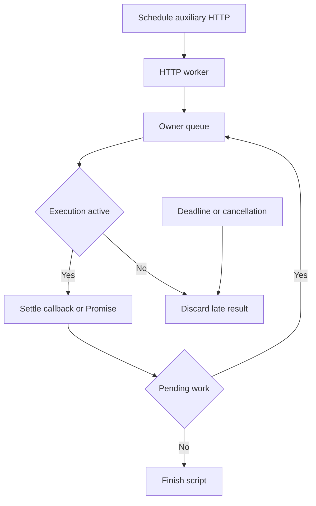

# Phase 12 — Promises, deadlines and cleanup

**Goal of this phase (plain English):** Complete Promise-based scripts and cancel all pending work safely.

**Dependencies:** Phase 11 checkpoint must be `[x] Done`.

## Do this now

1. [ ] Add Promise return form and owner-loop settlement/rejection tracking.
2. [ ] Integrate script deadline with HTTP cancellation and late-result disposal.
3. [ ] Enforce response/log limits and reject unsupported timer/module APIs.
4. [ ] Test handled/unhandled rejection, infinite loop and skip with pending HTTP.
5. [ ] Run scripting race tests and repeat cancellation test to detect leaked work.

Stuck on any step? See **Design details** below.

## Checkpoint — Phase 12

- **Status:** `[ ] Not started`
- **What was actually done:** Not implemented. Fill in changed files, decisions and deviations when work occurs.
- **Verification:** `go test ./internal/scripting` plus the named test cases below; add affected CLI integration tests. Record the actual test names if refined. 
- **Evidence:** Not run. Record command, exit status and observed assertions here.
- **Next step:** Phase 13, task 1: [phase-13-postman-data.md](phase-13-postman-data.md)
- **Resume cursor if interrupted:** Task 1; replace with exact task/test/file before handing off.

---

## Design details (LLD)

*Reference material — consult if a task is unclear. Before starting, refine function signatures against the completed code; preserve the behavioral contract linked below.*

- Only the runtime owner resolves/rejects Promises; watchdog uses documented interrupt mechanism.
- 5-second per-entry deadline includes host HTTP work; native functions must honor context. No hard JS heap isolation is claimed.
- Full fixed behavior and edge cases: [IMPLEMENTATION.md](../IMPLEMENTATION.md). Record deviations explicitly; a shorter phase file does not remove requirements.

## Test stubs

- `TestPromiseAuthBeforeMain` — Promise chain sets token before send.
- `TestUnhandledRejectionFails` — script exit 5.
- `TestAsyncCancel` — all owned requests settle or cancel.

## Flow diagram

The runtime owner settles HTTP results; cancellation stops outstanding work.

