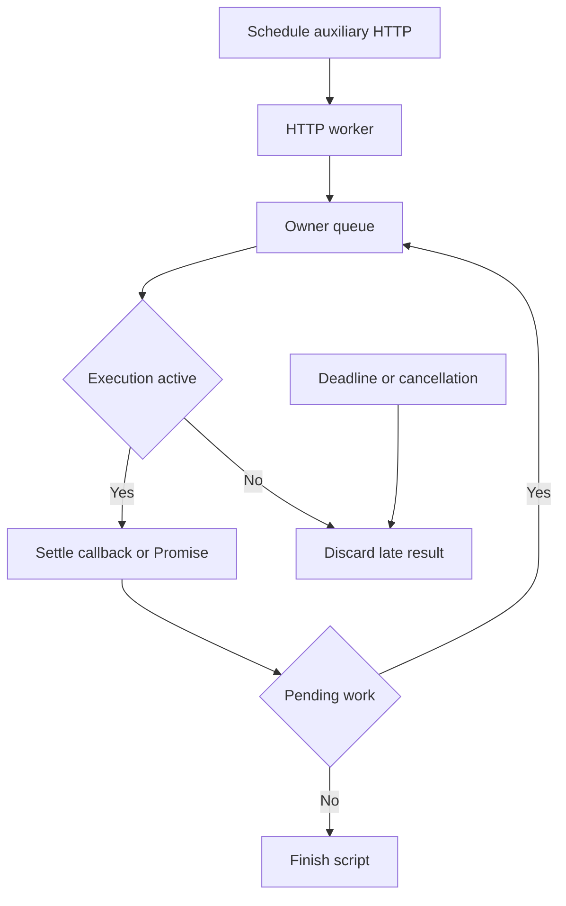

# Phase 12 — Promises, deadlines and cleanup

**Goal of this phase (plain English):** Complete Promise-based scripts and cancel all pending work safely.

**Dependencies:** Phase 11 checkpoint must be `[x] Done`.

## Do this now

1. [x] Add Promise return form and owner-loop settlement/rejection tracking.
2. [x] Integrate script deadline with HTTP cancellation and late-result disposal.
3. [x] Enforce response/log limits and reject unsupported timer/module APIs.
4. [x] Test handled/unhandled rejection, infinite loop and skip with pending HTTP.
5. [x] Run scripting race tests and repeat cancellation test to detect leaked work.

Stuck on any step? See **Design details** below.

## Checkpoint — Phase 12

- **Status:** `[x] Done`
- **What was actually done:** `pm.sendRequest` now accepts the existing callback form and a one-argument Promise form. Promise results are settled only on the runtime owner goroutine; Goja rejection tracking fails the entry for unhandled rejections while late handlers clear the pending failure. Host completions and Promise reactions share the existing FIFO/concurrency/20-request/10 MiB limits. Cancellation, skip and runtime failures cancel the run context, suppress late callback/Promise delivery and dispose queued work. The existing 5-second per-entry context deadline therefore covers auxiliary HTTP. Timers/modules remain unexposed and native reference errors fail loudly.
- **Changed files:** `internal/scripting/async.go`, `internal/scripting/bindings.go`, `internal/scripting/loop.go`, `internal/scripting/phase12_test.go`, `internal/execution/lifecycle_test.go`, `req-iterative-plan/PLAN.md`, `req-iterative-plan/phases/index.md`, `docs/decisions.md`, `req-iterative-plan/handoff.md`.
- **Verification:** Focused scripting/execution tests cover Promise token acquisition before the main request, async IIFEs, response chaining, handled and unhandled rejections, response-body limits, cancellation/deadline/skip disposal, unsupported timers/modules and the existing infinite-loop watchdog. Full and race suites were run with the commands recorded below.
- **Evidence:** `rtk go test -count=1 -timeout=120s ./internal/scripting ./internal/execution` passed (112 tests); `rtk go test -count=1 -timeout=120s ./...` passed (220 tests, 8 packages); `rtk go test -race -count=1 -timeout=180s ./internal/scripting` passed (91 tests); `rtk go test -race -count=1 -timeout=180s ./...` passed (220 tests, 8 packages); repeated cancellation `rtk go test -race -count=10 -timeout=180s -run 'Test(AsyncCancelDisposesPromiseResult|SkipWithPendingPromiseCancelsHTTP|AuxiliaryDeadlineCancelsHTTP)' ./internal/scripting` passed (30 tests); `rtk go vet ./...` and `rtk git diff --check` exited 0.
- **Next step:** Phase 13, task 1: [phase-13-postman-data.md](phase-13-postman-data.md)
- **Resume cursor if interrupted:** Re-run the Phase 12 verification commands, then begin Phase 13 import data structures.

---

## Design details (LLD)

*Reference material — consult if a task is unclear. Before starting, refine function signatures against the completed code; preserve the behavioral contract linked below.*

- Only the runtime owner resolves/rejects Promises; watchdog uses documented interrupt mechanism.
- 5-second per-entry deadline includes host HTTP work; native functions must honor context. No hard JS heap isolation is claimed.
- Full fixed behavior and edge cases: [IMPLEMENTATION.md](../IMPLEMENTATION.md). Record deviations explicitly; a shorter phase file does not remove requirements.

## Test stubs

- `TestPromiseAuthBeforeMain` — Promise chain sets token before send.
- `TestUnhandledRejectionFails` — script exit 5.
- `TestAsyncCancel` — all owned requests settle or cancel.

## Flow diagram

The runtime owner settles HTTP results; cancellation stops outstanding work.

