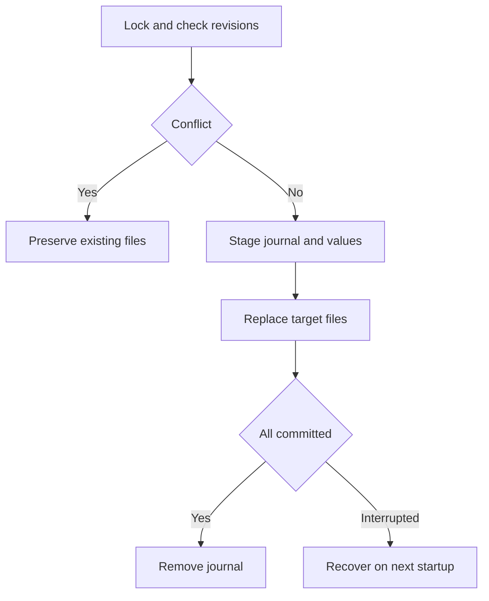

# Phase 17 — Persist extracted variables safely

**Goal of this phase (plain English):** Reuse extracted tokens across independent CLI invocations.

**Dependencies:** Phase 16 checkpoint must be `[x] Done`.

## Do this now

1. [x] Collect dirty collection/environment overlays and enforce persistence eligibility.
2. [x] Add --persist-vars with revision checks under workspace mutation lock.
3. [x] Stage paired writes and a small recovery journal.
4. [x] Implement startup recovery or explicit blocking for incomplete transactions.
5. [x] Test fresh-process token reuse, opt-out and failure between paired writes.

Stuck on any step? See **Design details** below.

## Checkpoint — Phase 17

- **Status:** `[x] Done`
- **What was actually done:** Added dirty operation tracking for environment and
  collection script layers, opt-in `req run --persist-vars`, lock-scoped
  revision checks, paired atomic writes and a bounded recovery journal. Startup
  via `Init`, `Discover` or `Open` recovers before/after pairs and blocks on
  unknown target bytes. Runtime/transport/body-limit/cancel/skip outcomes do not
  persist; assertion and HTTP-status failures do when otherwise eligible.
- **Changed files:** `internal/variables/scope.go`,
  `internal/variables/scope_test.go`, `internal/scripting/bindings.go`,
  `internal/store/variables.go`, `internal/store/variables_test.go`,
  `internal/store/errors.go`, `internal/store/workspace.go`,
  `internal/cli/variables.go`, `internal/cli/run.go`, `internal/cli/root.go`,
  `internal/cli/workspace.go`, `internal/cli/persist_vars_test.go`,
  `internal/execution/lifecycle.go`, `internal/execution/run.go`,
  `internal/execution/persistence_test.go`,
  `docs/compatibility.md`, `docs/decisions.md`, and the phase trackers.
- **Verification:** `rtk go test ./internal/variables ./internal/scripting
  ./internal/store ./internal/execution ./internal/cli -count=1` passed;
  named `TestPersistTokenAcrossProcesses`, `TestNoPersistByDefault`,
  `TestPersistEligibility`, `TestPersistFailurePrecedence`,
  `TestPersistCancellationPrecedence`, `TestRecoveryAcquiresWorkspaceLock`,
  and `TestJournalRecovery` passed. Full, race, vet,
  gofmt and diff gates also passed (see handoff).
- **Evidence:** Separate `Run` invocations reused a persisted bearer token;
  default runs left the environment unchanged; table-driven runtime, skip,
  assertion, HTTP-status and transport cases matched the eligibility policy;
  an interrupted collection/environment pair rolled back on `Open` and its
  journal was removed.
- **Next step:** Phase 18, task 1: [phase-18-output.md](phase-18-output.md)
- **Resume cursor if interrupted:** Phase 18, task 1; see [phase-18-output.md](phase-18-output.md).

---

## Design details (LLD)

*Reference material — consult if a task is unclear. Before starting, refine function signatures against the completed code; preserve the behavioral contract linked below.*

- internal/store/variables.go persists eligible overlays, not local/CLI variables.
- Runtime/transport/cancel/skip prevent persistence; assertion and HTTP-status failure alone do not. See specification section 7.
- Full fixed behavior and edge cases: [IMPLEMENTATION.md](../IMPLEMENTATION.md). Record deviations explicitly; a shorter phase file does not remove requirements.

## Test stubs

- `TestPersistTokenAcrossProcesses` — second invocation authenticates.
- `TestNoPersistByDefault` — second invocation has no token.
- `TestJournalRecovery` — interrupted paired write is not silently inconsistent.

## Flow diagram

A journal makes interruption between collection and environment writes recoverable.

