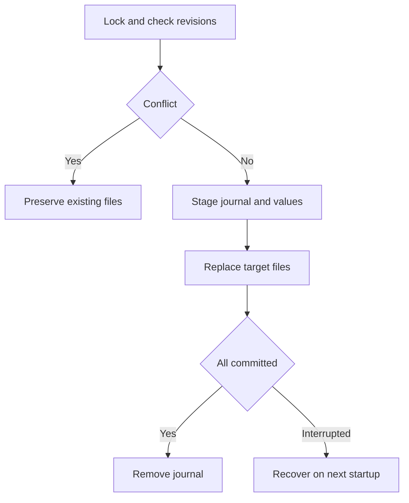

# Phase 17 — Persist extracted variables safely

**Goal of this phase (plain English):** Reuse extracted tokens across independent CLI invocations.

**Dependencies:** Phase 16 checkpoint must be `[x] Done`.

## Do this now

1. [ ] Collect dirty collection/environment overlays and enforce persistence eligibility.
2. [ ] Add --persist-vars with revision checks under workspace mutation lock.
3. [ ] Stage paired writes and a small recovery journal.
4. [ ] Implement startup recovery or explicit blocking for incomplete transactions.
5. [ ] Test fresh-process token reuse, opt-out and failure between paired writes.

Stuck on any step? See **Design details** below.

## Checkpoint — Phase 17

- **Status:** `[ ] Not started`
- **What was actually done:** Not implemented. Fill in changed files, decisions and deviations when work occurs.
- **Verification:** `go test ./internal/store` plus the named test cases below; add affected CLI integration tests. Record the actual test names if refined. 
- **Evidence:** Not run. Record command, exit status and observed assertions here.
- **Next step:** Phase 18, task 1: [phase-18-output.md](phase-18-output.md)
- **Resume cursor if interrupted:** Task 1; replace with exact task/test/file before handing off.

---

## Design details (LLD)

*Reference material — consult if a task is unclear. Before starting, refine function signatures against the completed code; preserve the behavioral contract linked below.*

- internal/store/transaction.go persists eligible overlays, not local/CLI variables.
- Runtime/transport/cancel/skip prevent persistence; assertion and HTTP-status failure alone do not. See specification section 7.
- Full fixed behavior and edge cases: [IMPLEMENTATION.md](../IMPLEMENTATION.md). Record deviations explicitly; a shorter phase file does not remove requirements.

## Test stubs

- `TestPersistTokenAcrossProcesses` — second invocation authenticates.
- `TestNoPersistByDefault` — second invocation has no token.
- `TestJournalRecovery` — interrupted paired write is not silently inconsistent.

## Flow diagram

A journal makes interruption between collection and environment writes recoverable.

