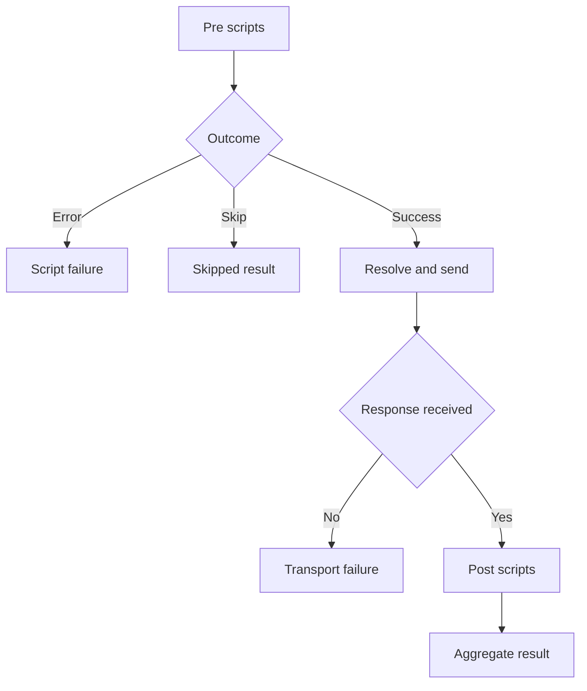

# Phase 8 — Script storage and inherited execution

**Goal of this phase (plain English):** Run pre/post JavaScript at collection, folder and request levels.

**Dependencies:** Phase 7 checkpoint must be `[x] Done`.

## Do this now

1. [ ] Reuse the existing model.Scripts ordered arrays and validation; add editor support preserving script boundaries.
2. [ ] Collect ancestor scripts and create one runtime per execution.
3. [ ] Run pre scripts before final variable resolution, then HTTP, then post scripts.
4. [ ] Implement --no-scripts, deadline, skip and phase-aware errors.
5. [ ] Test nested inherited ordering, skip and runtime failure before send.

Stuck on any step? See **Design details** below.

## Checkpoint — Phase 8

- **Status:** `[ ] Not started`
- **What was actually done:** Not implemented. Fill in changed files, decisions and deviations when work occurs.
- **Verification:** `go test ./internal/execution` plus the named test cases below; add affected CLI integration tests. Record the actual test names if refined. 
- **Evidence:** Not run. Record command, exit status and observed assertions here.
- **Next step:** Phase 9, task 1: [phase-9-script-bindings.md](phase-9-script-bindings.md)
- **Resume cursor if interrupted:** Task 1; replace with exact task/test/file before handing off.

---

## Design details (LLD)

*Reference material — consult if a task is unclear. Before starting, refine function signatures against the completed code; preserve the behavioral contract linked below.*

- internal/execution/lifecycle.go owns phase order; HTTP package knows nothing about scripts.
- Reuse the Phase 1 runtime owner loop from the first production script. Introduce bounded response buffering and cancellation/error precedence here, before exposing response data; Phase 12 extends auxiliary limits and Phase 18 adds output modes. Do not defer main-response safety until Phase 18.
- An HTTP error status still runs post scripts; a transport failure does not. Use execution flow in hld.md.
- Full fixed behavior and edge cases: [IMPLEMENTATION.md](../IMPLEMENTATION.md). Record deviations explicitly; a shorter phase file does not remove requirements.

## Test stubs

- `TestScriptHierarchy` — collection, outer folder, inner folder, request in both phases.
- `TestPreErrorNoSend` — no main HTTP request.
- `TestScriptSkip` — no remaining scripts or main HTTP.

## Flow diagram

A pre-script failure or skip prevents sending; valid responses enter post scripts.

