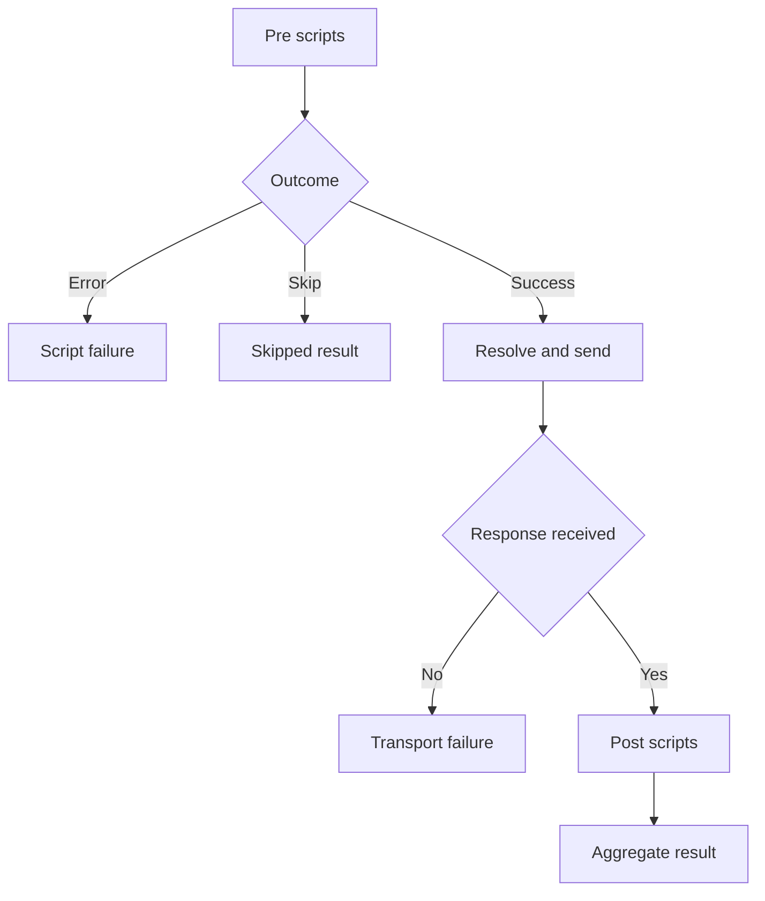

# Phase 8 — Script storage and inherited execution

**Goal of this phase (plain English):** Run pre/post JavaScript at collection, folder and request levels.

**Dependencies:** Phase 7 checkpoint must be `[x] Done`.

## Do this now

1. [ ] Reuse the existing model.Scripts ordered arrays and validation; add editor support preserving script boundaries.
2. [ ] Collect ancestor scripts and create one runtime per execution.
3. [ ] Run pre scripts before final variable resolution, then HTTP, then post scripts.
4. [ ] Implement --no-scripts, deadline, skip and phase-aware errors.
5. [ ] Test nested inherited ordering, skip and runtime failure before send.

Stuck on any step? See **Design details** below.

## Checkpoint — Phase 8

- **Status:** `[x] Done`
- **What was actually done:** Implemented by a subagent-implementer pass, then reviewed and corrected by the integrator (marker-in-new-content rejection, gofmt/line-ending normalization). Added internal/execution/lifecycle.go (`ScriptPolicy`, `InheritedScripts`, `RunLifecycle`, `DefaultScriptTimeout` 5s, `MaxScriptBodyBytes` 10 MiB) and lifecycle_test.go. Split the scripting engine's spike surface (vars/log/httpGet/httpGetAsync + varStore) into test-only spike_bindings_test.go behind `newSpikeEngine()`; `NewEngine()` now installs the production surface: `pm.execution.skipRequest()` (flag + thrown sentinel; the flag survives a caught sentinel and wins over later errors) and `console.log/info/warn/error` (uncapped until Phase 9). `Report.Skipped` added. Extracted `dispatch` from Execute in internal/execution/run.go (send prologue + status line; Execute behavior unchanged) and added exit code 5. Store gained `UpdateScripts(ctx, path, *model.Scripts, expected Revision)` (collection root, folder or request; nil when both arrays empty). CLI: extracted `launchEdit` from editJSON in edit.go (request-edit messages byte-identical; all prior edit tests pass unchanged), new internal/cli/script.go with `req script edit PATH (--pre|--post)` editing one combined source with `// ---- req script <ID> ----` separator lines (IDs must survive unchanged in count/order/value; enabled flags and provenance are preserved by ID; zero entries + non-empty marker-free text creates one enabled entry; markers inside new content are rejected), run.go gained `--no-scripts` and `--script-timeout`, root.go routes `script` and updates help. `req send` intentionally does not accept the script flags: direct sends have no scripts.
- **Verification:** `go test -count=1 ./...` green — 126 test functions pass (105 at Phase 7 HEAD + 21 new). Named tests implemented as specified: TestScriptHierarchy, TestPreErrorNoSend, TestScriptSkip in internal/execution/lifecycle_test.go, plus TestPostErrorStillReturnsBody, TestTransportFailureNoPostScripts, TestHTTPErrorStillRunsPostScripts (incl. --fail and script-error-beats---fail precedence), TestScriptTimeout, TestSkipInPostPhase, TestNoScriptsFlag, TestBodyLimitNoPostScripts, TestDisabledEntriesDoNotRun, TestInheritedScriptsOrder. CLI: TestScriptEditHappyPath (incl. usage errors and unexpected-separator rejection), TestScriptEditRoundTrip, TestScriptEditDamagedMarker, TestScriptEditZeroEntriesUnchanged, TestScriptEditFolderAndCollectionRoot, TestRunScriptLifecycle. Scripting: TestSkipRequestSignal, TestSkipCaughtStillSkips, TestSpikeGlobalsAbsent.
- **Evidence:** `gofmt -l internal cmd` → no output (after fixing CRLF endings the subagent introduced); `go vet ./...` exit 0; `go build ./...` exit 0; `go test -count=1 ./...` exit 0 (all 7 packages ok); `go test -count=1 -v ./... | grep -c "^--- PASS: "` → 126; `go test -race -count=1 ./...` exit 0; `git diff --check` clean. All on Windows with loopback servers.
- **Next step:** Phase 9, task 1: [phase-9-script-bindings.md](phase-9-script-bindings.md)
- **Resume cursor if interrupted:** Done; Phase 9 task 1 (scoped variable bindings) is next.

---

## Design details (LLD)

*Reference material — consult if a task is unclear. Before starting, refine function signatures against the completed code; preserve the behavioral contract linked below.*

- internal/execution/lifecycle.go owns phase order; HTTP package knows nothing about scripts.
- Reuse the Phase 1 runtime owner loop from the first production script. Introduce bounded response buffering and cancellation/error precedence here, before exposing response data; Phase 12 extends auxiliary limits and Phase 18 adds output modes. Do not defer main-response safety until Phase 18.
- An HTTP error status still runs post scripts; a transport failure does not. Use execution flow in hld.md.
- Full fixed behavior and edge cases: [IMPLEMENTATION.md](../IMPLEMENTATION.md). Record deviations explicitly; a shorter phase file does not remove requirements.

## Test stubs

- `TestScriptHierarchy` — collection, outer folder, inner folder, request in both phases.
- `TestPreErrorNoSend` — no main HTTP request.
- `TestScriptSkip` — no remaining scripts or main HTTP.

## Flow diagram

A pre-script failure or skip prevents sending; valid responses enter post scripts.

